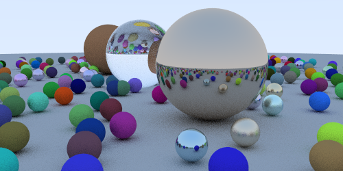

# Raytracing in Rust
  

An implementation of Peter Shirley's Ray Tracing in One Weekend. This project was created with the sole purpose of improving my knowledge of the Rust language.

## How to build
```rust
cargo build
```

## Running the code
```rust
cargo run
```

## References
[[1] Raytracing in one weekend, Peter Shirley](https://raytracing.github.io/books/RayTracingInOneWeekend.html)
